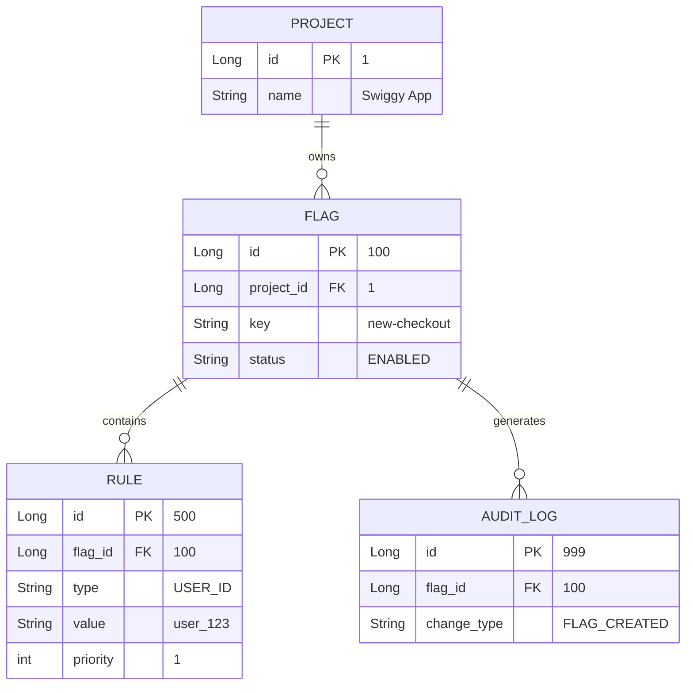

# Feature Flag System Design & Data Flow

Don't worry, building an entire system from scratch is a lot to take in! Let's break down how the whole system works using a real-world example.

> [!NOTE]
> **The Goal:** A mobile app (like Swiggy) wants to know if it should show a shiny **New Checkout UI** to a specific user. It asks our API: *"Hey, should I show the new checkout to User 123?"* 

Our API will reply with either `true` or `false` based on the data in our tables.

---

## 1. The Database Architecture (ERD)

This diagram shows how our 4 tables relate to each other. 
* The `||--o{` symbol means **"One-to-Many"**. (One Project has Many Flags).

### The Hierarchy Explained:
1. **PROJECT:** The highest level. You might have one project called "Swiggy App" and another called "Swiggy Delivery Partner App". They are isolated from each other.
2. **FLAG:** A specific feature inside a project. For example, `new-checkout`. A flag can be completely `ENABLED` (everyone gets it) or `DISABLED` (nobody gets it).
3. **RULE:** The magic logic. If a flag is enabled, we check the rules. A rule says: *"Only show this to users whose ID is 'user_123'"* or *"Only show this to 10% of users"*.
4. **AUDIT LOG:** A history book. If someone turns off the `new-checkout` flag, we record who did it and when, so we can blame them if the app breaks!

---

## 2. The Evaluation Data Flow

What actually happens when the Swiggy App asks our API for the flag status? This is called **Evaluation**.

Because the Swiggy app might ask this question *millions of times a minute*, we can't always ask PostgreSQL (it would crash). This is why we use **Redis** (an ultra-fast in-memory cache).

```mermaid
sequenceDiagram
    participant App as Swiggy Mobile App
    participant API as Spring Boot API
    participant Cache as Redis (Fast)
    participant DB as PostgreSQL (Slow)

    App->>API: GET /evaluate/project-1/new-checkout?userId=user_123
    
    rect rgb(0, 40, 0)
    Note over API,Cache: Step 1: Check the Cache
    API->>Cache: Do we know the answer for user_123?
    end
    
    alt Found in Cache
        Cache-->>API: Yes! Result is TRUE.
        API-->>App: { "enabled": true } (Fast Response)
    else Not in Cache
        rect rgb(0, 0, 40)
        Note over API,DB: Step 2: Query the Database
        API->>DB: Get Flag & Rules for 'new-checkout'
        DB-->>API: Returns Flag (ENABLED) and Rules
        end
        
        rect rgb(40, 0, 40)
        Note over API: Step 3: Run the Logic Engine
        API->>API: Does user_123 match the rule? -> YES.
        end
        
        rect rgb(40, 40, 0)
        Note over API,Cache: Step 4: Save for later
        API->>Cache: Save "user_123 = TRUE" for 60 seconds
        end
        
        API-->>App: { "enabled": true }
    end
```

### Step-by-Step Logic
1. **The Request:** Swiggy asks: "Is `new-checkout` enabled for `user_123` in `project-1`?"
2. **The Cache Check:** We check Redis. If we recently calculated this, we return the answer instantly.
3. **The Database Fetch:** If not in Redis, we grab the Flag and its Rules from PostgreSQL.
4. **The Engine:** We evaluate the rules. We look at the first rule: *"Is this user_123?"*. It matches! So the engine decides the flag is `TRUE`.
5. **Caching:** We save the answer `TRUE` in Redis for a minute. If Swiggy asks again 2 seconds later, we don't need to do any of this math again.

This combination of **PostgreSQL for permanent storage** and **Redis for high-speed checking** is a classic Enterprise system design!
